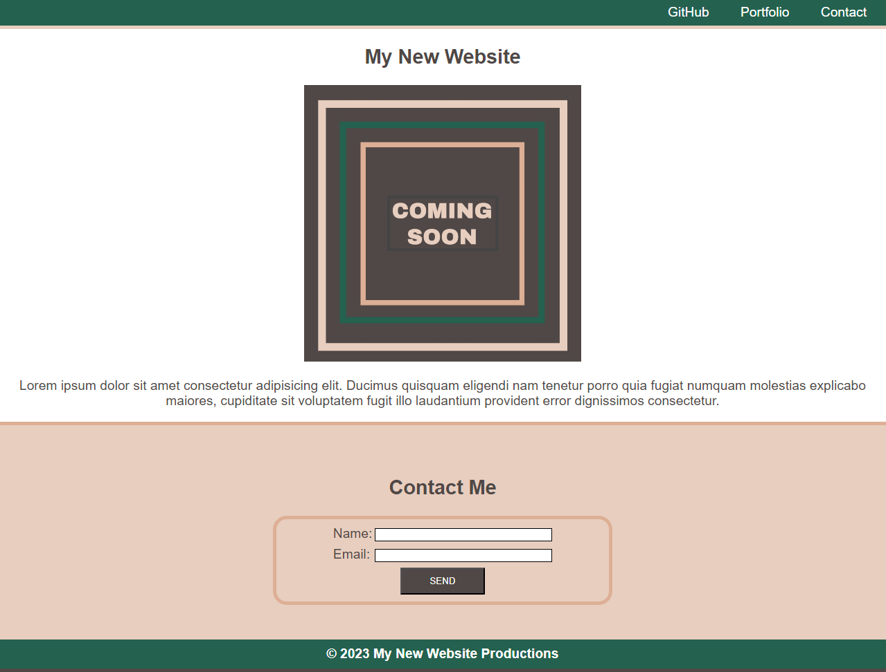

# Landing Page Mini Project

## Description

This is a project for UW bootcamp in which a sample webpage was reformatted using basic CSS.

## Installation

N/A

## Usage

This page is an exercise in using the box model to format a simple webpage. There is no functionality to it.

Link to deployed application: 

## Credits

N/A

## License

N/A